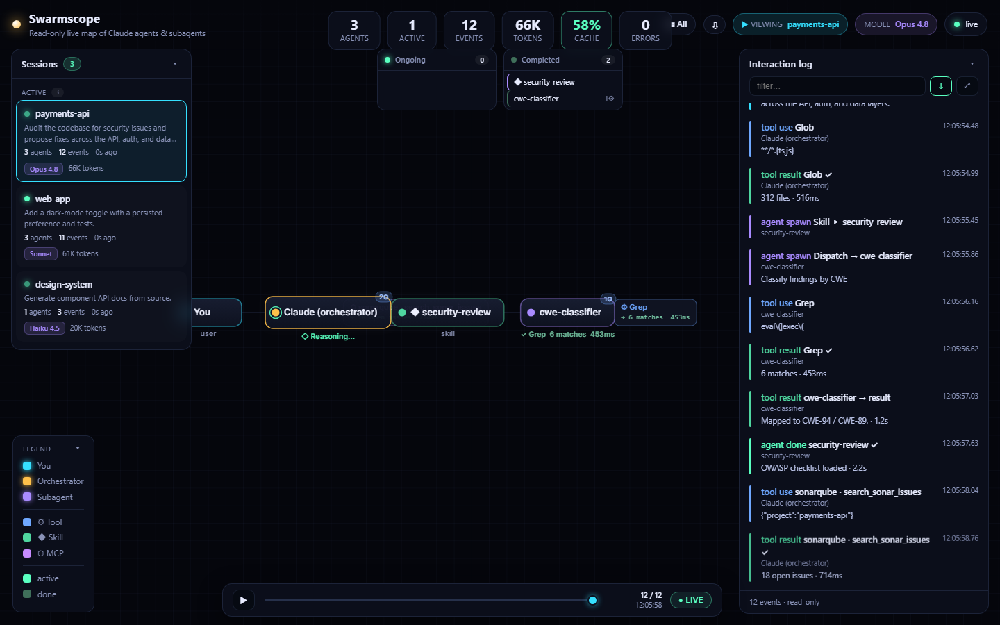
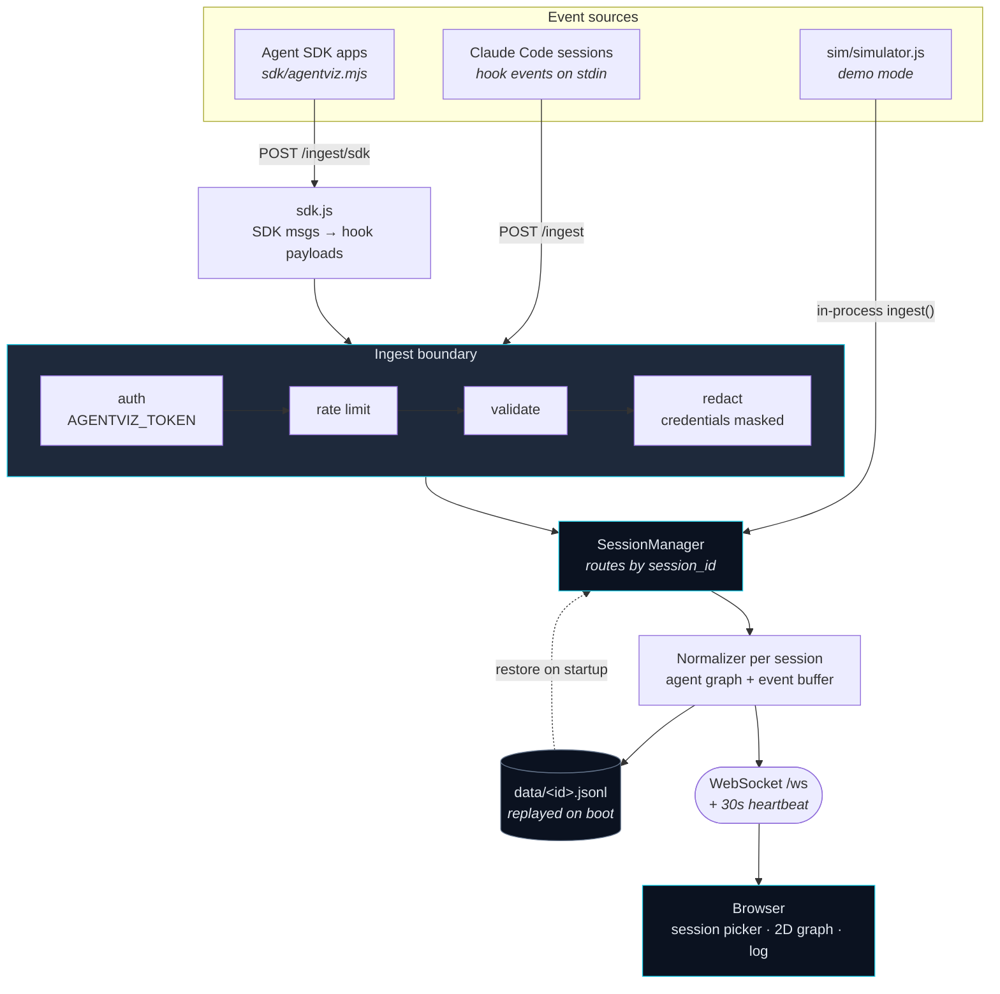
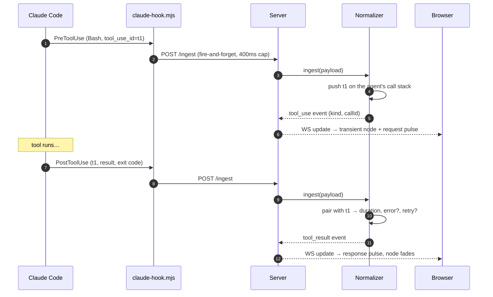
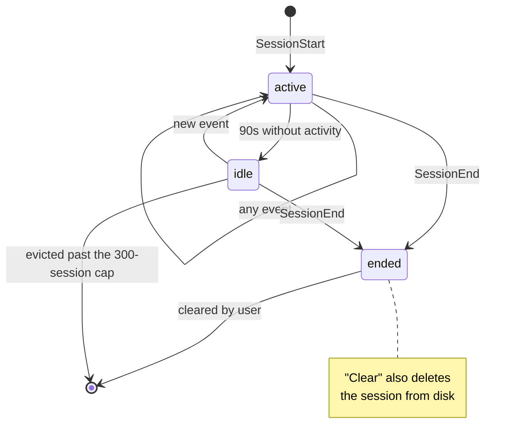

# ClaudeLens — Claude Multi-Agent Visualization

**ClaudeLens** is a **read-only, real-time map & timeline debugger** that runs alongside your
Claude Code sessions and shows the whole agent swarm at work: the orchestrator, every
subagent it dispatches, the skills and tools they call, and the messages/results flowing
between them — as a clean, animated **2D node-link graph**, backed by a scrolling
interaction log.

It is **global and multi-session**: it captures *every* active Claude session (keyed by
`session_id`), gives you a **session picker**, and a **combined "All" canvas** that puts
every session on one graph (`You → session → its agents`). Sessions are **persisted to disk**
so they survive a restart, and any session can be **exported** to JSON for sharing.

It is generic (any Claude Code session, any task), self-hosted, offline-capable, and ships
as a lightweight hook you drop into your Claude settings — plus a bridge for **Claude Agent
SDK** apps.

Zero runtime dependencies beyond Express and `ws`; no build step, no CDN, no telemetry —
nothing ever leaves your machine unless you deliberately bind it to your network.



## Install

**Desktop app (recommended)** — a tray-resident build for Windows, macOS and Linux that keeps
ClaudeLens running in the background. Grab an installer from
[Releases](https://github.com/architonixlabs/claude-lens/releases), then use the tray menu →
**Install Claude Code hooks…** and restart your Claude sessions. Tray → **Start at login**
makes it permanent. See [RELEASE.md](RELEASE.md) for per-platform notes (the builds are
unsigned, so SmartScreen/Gatekeeper will warn).

**From source** — requires **Node 18+**; both launchers free the port, start the server and
open the UI:

| Windows     | macOS / Linux |
|-------------|---------------|
| `start.bat` | `./start.sh`  |

Add `demo` to either (`start.bat demo`) to watch the built-in synthetic run instead of
waiting for a live session.

---

## What you see

- **Session picker** (left panel): every active Claude session — labelled by its **project
  folder**, with the first prompt, agent/event counts, a live status dot, the **model in
  use** and **token usage**. Click one to watch it.
- **You → Claude (orchestrator) → subagents** laid out left→right as clean node chips, each
  showing its name and status — no overlap, no occlusion.
- **Tools, skills and MCP calls** appear as small **chips beside the agent** that made them
  (⚙ tool, ◆ skill, ⬡ MCP) showing the **call detail** (file / command) and, on return, the
  **result + duration** (`Bash → 4 raw() calls · 407ms`); a tool-count badge sits on each agent.
- **Live activity line** under every agent — what it's doing right now (`▸ Bash · npm test`)
  or last did (`✓ Read → 88 lines`), so the orchestrator never looks idle.
- **Errors** surface in **red**: failed tools / non-zero exits / failed subagents turn the
  node, chip, and log row red and bump an **errors** count (per-session badge + HUD tile).
- **Message flow**: every dispatch, tool call, and result sends a **pulse gliding along the
  link** — request out, response back — and the target flashes as it acts on it.
- **Node state** by color: `active` glows + ring, `done` settles, `error` red, `idle` dims.
- **Interaction log** (right panel): every event with detail + duration, color-coded,
  filterable, auto-scrolling, collapsible — read-only.
- **Session picker** groups sessions into **Active / Inactive / Done** sections (scrollable),
  with **clear** buttons for the inactive/done ones. Every panel collapses (▾); temp/scratch
  sessions are filtered out.
- **Two task boxes** on the canvas — **Ongoing / Completed** — list the subagents/skills by
  status (with tool counts); click one to jump to it.
- **Thinking status** — an active agent that's between tool calls (the model is generating,
  which fires no hook) shows a live cycling `◇ Reasoning… / Generating…` line instead of
  looking idle.
- **Node inspector** — click any node for its full details: type, status, parent, tool count,
  and its complete event history (with durations, results, errors, retries). On the
  orchestrator it also shows **cache-hit %**, **tool breakdown** (`Read ×5 · Bash ×3`), and
  any **memory-trim** count.
- **Timeline** (bottom) — the session is **recorded**; scrub back through it, ▶ play it, or
  jump to **● LIVE**. Navigate to any moment to see the graph + log as of then.
- **▶ Viewing `<session>`** indicator shows which session's canvas you're on; **▦ All** shows
  a **combined canvas** — *every* session on one graph (`You → session → its agents`) with a
  merged live log — click any node to drill into that session.
- **Errors** turn nodes/chips/log-rows red; **compaction** (Claude's `PreCompact` and our own
  buffer trimming) is surfaced, never silently dropped.
- **Live stats**: agents, active, events, **tokens** (K/M/B), **cache %**, **errors** — plus
  the current **model** pill.
- Static, analyzable view (no spinning). Drag to pan, scroll to zoom, **⤢** to re-fit; hover
  a node for its details.

Everything is **read-only** — the app never sends anything back into your session.

---

## Quick start

```bash
npm install
npx playwright install chromium   # only needed to run the E2E tests

# 1) See it immediately with the built-in demo (loops a synthetic multi-agent run):
npm run demo
#    → open http://localhost:4317

# 2) Or run it live and wire your Claude session's hooks into it (below):
npm start
```

### Configuration

All settings are environment variables; the server also accepts `--port=`, `--host=`,
`--demo` and `--speed=` as CLI flags (flags win, so npm scripts work on Windows too).

| Variable | Default | What it does |
|----------|---------|--------------|
| `PORT` | `4317` | Server port. |
| `HOST` / `AGENTVIZ_HOST` | `127.0.0.1` | Bind address. **Loopback by default** — see [Security](#security--privacy) before changing it. |
| `AGENTVIZ_TOKEN` | *(unset)* | Shared secret required on write endpoints. Strongly recommended if you expose the port. |
| `AGENTVIZ_DATA` | `./data` | Where session history (JSONL) is stored. |
| `AGENTVIZ_NO_PERSIST` | `0` | `1` disables writing history to disk entirely. |
| `AGENTVIZ_NO_REDACT` | `0` | `1` disables credential masking. Leave it on unless debugging the tool. |
| `AGENTVIZ_RATE_MAX` | `600` | Write requests per 10 s per IP; `0` disables. Loopback is exempt. |
| `AGENTVIZ_RATE_ALL` | `0` | `1` also rate-limits loopback (off by default — local bursts are legitimate). |
| `AGENTVIZ_DEMO` | `0` | `1` auto-plays the synthetic multi-agent run on a loop. |
| `AGENTVIZ_SPEED` | `1` | Demo playback multiplier. |
| `AGENTVIZ_VERBOSE` | `0` | `1` logs every ingested event (default logs only new sessions + errors). |
| `AGENTVIZ_TRANSCRIPT_DIRS` | *(unset)* | Extra directories allowed for transcript reads, beyond `~/.claude`. |
| `AGENTVIZ_PRICE_INPUT` / `_OUTPUT` / `_CACHE_READ` / `_CACHE_WRITE` | *(unset)* | USD per **million** tokens. Cost reporting is off until you set these — see below. |

The hook bridge reads `AGENTVIZ_PORT` / `AGENTVIZ_URL` / `AGENTVIZ_TOKEN` to find and
authenticate against the server.

### Docker

ClaudeLens can't read hooks from inside a container (hooks run on the host), so the image is
meant as a **shared viewer** that host machines post to:

```bash
docker build -t claude-lens .
docker run -p 4317:4317 -e AGENTVIZ_TOKEN=your-secret -v claudelens-data:/data claude-lens
```

Then point each machine's bridge at it:
`AGENTVIZ_URL=http://<host>:4317/ingest AGENTVIZ_TOKEN=your-secret`.

---

## Wire it into a live Claude Code session

The app learns what your agents are doing through **Claude Code hooks**. A tiny bridge
script forwards each hook event to the running server; the server normalizes it into an
agent graph and pushes it to every open browser over WebSocket.

```bash
npm install
npm run install-hooks  # wire the hooks into ~/.claude/settings.json (global = all sessions)
```

Then **restart your other Claude Code sessions** (or start a new one) and watch the
constellation build itself at `http://localhost:4317`. You do **not** need to start the
server manually — on `SessionStart` the hooks **auto-start** it (detached, so it keeps
running and capturing every session). The installer:

- **appends** our commands to each hook event — any hooks you already have are left intact;
- wires an **auto-start** command into `SessionStart` (`ensure-server.mjs`) that boots the
  server if it isn't already up, and a **forward** command (`claude-hook.mjs`) into every
  event that posts it to the server;
- is **idempotent** (safe to re-run) and writes a timestamped `settings.json.bak-*` backup;
- takes `--project` (use `./.claude/settings.json`), `--settings=PATH`, `--port=N`,
  `--no-autostart` (wire forwarding only — you run `npm start` yourself), and `--remove`
  (uninstall). `npm run uninstall-hooks` is the shortcut for the last.

> Prefer to run it yourself? `npm start` still works, and auto-start becomes a no-op when a
> server already owns the port.

The bridge ([`hooks/claude-hook.mjs`](hooks/claude-hook.mjs)) is **fire-and-forget** with a
400 ms timeout and always exits `0`, so the visualizer can never slow down or break your
session — if the server isn't running, hooks simply no-op. (Prefer to wire it by hand?
[`hooks/settings.snippet.json`](hooks/settings.snippet.json) is the manual equivalent; point
the bridge elsewhere with `--port=`/`--url=` args or `AGENTVIZ_PORT`/`AGENTVIZ_URL`.)

> ⚠️ **Claude Desktop is not supported** — it has no hooks mechanism, so Desktop sessions
> can't be captured. This works with **Claude Code** (CLI and the VS Code / JetBrains
> extensions) only.

---

## Include your own SDK-based apps

Apps built on the **Claude Agent SDK** (`@anthropic-ai/claude-agent-sdk`) don't fire Claude
Code hooks, so they wire in differently — by streaming their SDK messages to the server.
Drop in [`sdk/agentviz.mjs`](sdk/agentviz.mjs) and wrap your existing `query()` loop:

```js
import { query } from '@anthropic-ai/claude-agent-sdk';
import { AgentViz } from './agentviz.mjs';

const viz = new AgentViz({ label: 'my-web-app', cwd: process.cwd() });
//   also accepts { url: 'http://host:4317', sessionId: '...' }

for await (const msg of viz.tap(query({ prompt, options }))) {
  // ...your normal message handling — unchanged...
}
```

`.tap()` forwards each SDK message (fire-and-forget, 500 ms timeout, never throws or blocks)
and re-yields it, so your loop is untouched. The server translates `system`/`assistant`/
`user`/`result` messages into the same normalized events — subagents (via the `Task` tool),
tool/skill/MCP calls (matched precisely by `tool_use_id`), the **model**, and **token usage**
(accumulated from each assistant message). The app appears in the picker under your `label`.

**Any language works** — it's just HTTP. `POST http://127.0.0.1:4317/ingest/sdk` with
`{ session_id, label?, cwd?, message }` (or `{ ..., messages: [...] }`), where `message` is a
raw SDK stream message. A Python app, for example:

```python
import requests
def report(message, sid="my-py-app"):
    try:
        requests.post("http://127.0.0.1:4317/ingest/sdk",
                      json={"session_id": sid, "label": "my-py-app", "message": message}, timeout=0.5)
    except Exception:
        pass
# call report(msg) for each message your SDK query yields
```

---

## How it works



Redaction sits **before** persistence deliberately: nothing secret is ever written to disk or
included in an export, rather than being scrubbed on the way out.

### A tool call, end to end



The bridge never blocks Claude: it exits `0` regardless, so if the server is down the hook
simply no-ops.

### Session lifecycle



Every hook payload carries a `session_id`; the **SessionManager** routes it to that
session's own `Normalizer` (graph) and event buffer. The browser is shown the list of all
sessions and subscribes to whichever one you pick. Both the live hook path and the demo
simulator feed the **same** normalizer, so the demo is a faithful rehearsal of real
sessions rather than a separate mock.

### Event model

Raw Claude hook payloads are normalized into events with a stable shape
(`server/normalize.js`):

| Claude hook          | Becomes                                                        |
|----------------------|----------------------------------------------------------------|
| `SessionStart`       | orchestrator activates (`session_start`)                       |
| `UserPromptSubmit`   | beam **You → Claude** (`message`)                              |
| `PreToolUse` (`Task`)| **subagent spawn** + beam parent → child                       |
| `PreToolUse` (`Skill`/`mcp__*`/other) | **tool_use** — a transient tool/skill/mcp node + request beam |
| `PostToolUse`(`Task`)| subagent **result** beam child → parent                        |
| `PostToolUse`(other) | **tool_result** — response beam back to the agent, node fades  |
| `SubagentStop`       | subagent marked `done` (`agent_done`)                          |
| `Notification`/`Stop`/`SessionEnd` | log notes / settle state                         |

`Pre`/`PostToolUse` for the same call are correlated by a per-agent stack and carry a
`callId` + `kind` (`tool` / `skill` / `mcp`), so the browser can pair each request with its
response. Non-`Task` tool events are attributed to the most-recently-spawned in-flight
subagent, falling back to the orchestrator — a **best-effort heuristic**, since hook payloads
don't always carry a distinct subagent identity (approximate for deeply parallel fan-outs).
Subagent **spawns**, **results**, and **stops** are always precise.

### Model & token usage

Each session card and the HUD show the **model** and **token usage**. Hook payloads don't
carry tokens, so the server reads the session's `transcript_path` **incrementally** (only the
bytes appended since the last read) to pull the latest `model` and cumulative
`input`/`output`/cache token counts. Reads are throttled and non-blocking. Demo sessions
stamp synthetic model + token data so this is visible without a live run.

---

## Testing

End-to-end tests (Playwright) drive the real server in demo mode and assert the whole
pipeline — the 2D canvas boots, WebSocket goes live, the demo stream builds the graph, the
log fills with normalized events, the filter works, and the HTTP endpoints behave:

```bash
npx playwright install chromium   # first time only
npm test
```

```text
33 passed ✓  2D canvas · WebSocket · graph builds · log + stats · filter · multi-session ·
             picker switch · sections + collapse · clear idle/ended · tool/skill/mcp ·
             skill→agent nesting · model + tokens (K/M/B) · cache% · durations · errors ·
             compaction/memory · retries · node inspector · timeline scrub/replay ·
             task boxes · viewing · combined canvas · export · search · health · SDK · labels
```

- `npm run test:unit` — **52 unit tests** (`node --test`) covering the normalizer, session
  routing/eviction/usage/search, the SDK bridge, disk persistence + replay, credential
  redaction, the auth gate, and the ingest guards.
- `npm run lint` — ESLint (flat config). `npm run test:all` runs lint + unit + E2E.
- `npm run stress [sessions] [eventsPer]` — load test. Sample: **41,000 ingests, 0 fail,
  ~1,900 req/s, p99 54 ms, memory ~370 MB** (the 300-session eviction cap holds it flat),
  cross-session search 50 hits in ~8 ms.

CI (GitHub Actions) runs lint + unit + E2E + a smoke stress on every push, and separately
verifies the hook installer is idempotent and uninstalls cleanly on **Ubuntu and macOS**.

> `npm test` runs Playwright only — unit tests are `node --test`. Playwright's `testMatch` is
> pinned to `*.spec.js` so it doesn't also collect the `*.test.mjs` unit files.

---

## Verdicts, not just pictures

The graph shows you *what happened*; these tell you whether it went well. Both are plain
HTTP, so a script, a notifier or an agent can consume them without opening the UI.

```bash
# One run's verdict — grade, 0-100 health, loops, stalls, slowest calls
curl localhost:4317/api/report?session=<id>

# ...as markdown, to paste into an issue or a PR
curl "localhost:4317/api/report?session=<id>&format=md"

# Only what deserves attention, across every session
curl localhost:4317/api/alerts
```

```text
# payments — degraded (48/100)

- **Status**: active
- **Duration**: 3m
- **Agents**: 1 · **Tool calls**: 5 · **Errors**: 4

## Why the score is not 100

- 4 errors (−40)
- 1 repeated call pattern (−12)
```

### Cost

Cost reporting is **off until you configure prices** — published rates change, and a stale
hard-coded table that quietly reports the wrong money is worse than reporting none. Set USD
per million tokens and the report gains a cost line plus what cache reuse saved you:

```bash
AGENTVIZ_PRICE_INPUT=3 AGENTVIZ_PRICE_OUTPUT=15 AGENTVIZ_PRICE_CACHE_READ=0.3 npm start
# → - **Cost**: ~$1.6200 (estimated; cache reuse saved ~$2.4300)
```

Effort is attributed **per agent** as time, calls and errors — deliberately *not* tokens.
Hook payloads carry no per-tool token counts (usage comes from the session transcript as a
running total), so a per-subagent token split would be invented rather than measured.

### What it detects

The score starts at 100 and subtracts, so **every deduction traces to something you can point
at** — no opaque metric. It detects:

- **Stalls** — an agent silent past the threshold while still marked active. An *ended*
  session is finished, not stuck, so it never reports as stalled.
- **Loops** — the same tool called with identical input three or more times (thrashing, not
  retrying).
- **Errors**, low cache reuse, and memory trimming.

The desktop tray shows alerts at the top of its menu with a `⚠ n` tooltip, so trouble reaches
you without opening anything.

---

## Project layout

```text
server/
  index.js        Express + WebSocket server, /ingest, /api/*, WS subscribe, auth, rate limit
  analysis.js     turns an observed run into a judgement: stalls, loops, health, report card
  normalize.js    raw hook payloads → normalized events + agent graph (single source of truth)
  sessions.js     Session + SessionManager: per-session_id graph, event buffer, pub/sub, eviction
  transcript.js   incremental transcript reader → model + token usage (path-allowlisted)
  persist.js      append-only JSONL history + replay on boot, with disk caps
  redact.js       masks credentials at the ingest boundary, before anything is stored
  sdk.js          Claude Agent SDK messages → hook payloads (for /ingest/sdk)
sdk/
  agentviz.mjs    drop-in client for SDK apps: viz.tap(query(...)) streams sessions in
hooks/
  claude-hook.mjs        Claude Code → /ingest bridge (fire-and-forget)
  ensure-server.mjs      SessionStart auto-start: boots the server if it isn't running
  install-hooks.mjs      idempotent installer (append/remove; --port/--project/--no-autostart)
  settings.snippet.json  manual drop-in hooks config
sim/
  scenario.js     three scripted runs (security audit / feature build / docs) as hook payloads
  simulator.js    drives several concurrent demo sessions, or one session over HTTP
  stress.js       load generator (npm run stress)
public/
  index.html, css/, js/{main,scene,ws,log}.js   (scene.js = 2D canvas node-link renderer)
tests/
  e2e.spec.js                       Playwright end-to-end suite (33)
  normalize|sessions|sdk|persist    node:test unit suites
  redact|auth|ingest-guards         security + guard unit suites
desktop/
  main.js         Electron tray app: adopts-or-starts the server, tray menu, autostart
  make-icons.mjs  generates the app + tray icons from code (npm run icons)
start.bat / start.sh    launchers (Windows / macOS+Linux)
Dockerfile              shared-viewer image (non-root, healthcheck, /data volume)
electron-builder.yml    installer config (nsis / dmg / AppImage / deb)
.github/workflows/ci.yml lint + tests + cross-platform hook-installer checks
```

### Desktop app

`npm run desktop` runs it from source; `npm run dist` builds installers for the current
platform (`dist/`). Each OS must be built on that OS — a macOS `.dmg` can't be produced from
Windows or Linux, so `.github/workflows/release.yml` builds all three on GitHub runners and
attaches them to the release when you push a `v*` tag.

Code signing and per-platform build options (including why Let's Encrypt can't issue a
code-signing certificate) are covered in **[SIGNING.md](SIGNING.md)**.

Two details worth knowing if you touch the packaging:

- **`hooks/` is unpacked from the asar.** Claude Code launches the bridge with plain `node`,
  which cannot read inside an asar archive, so those files must exist on disk.
- **The packaged app stores history in the OS user-data directory**, not next to the
  executable — the app directory is read-only inside the asar.

---

## Security & privacy

Session data is **sensitive** — it carries your prompts, file paths, commands and tool
output. The defaults assume a single developer on one machine, and the tool is built to fail
closed rather than leak.

- **Loopback by default.** The server binds `127.0.0.1`, so nothing is reachable from your
  network until you deliberately set `HOST=0.0.0.0` (which prints a warning on boot).
- **Credential redaction.** Before anything is stored or exported, string values are scrubbed
  of vendor API keys, AWS access-key ids, JWTs, bearer tokens, `KEY=VALUE` secrets and inline
  URL credentials (`server/redact.js`). Surrounding context stays readable —
  `curl -H "x-api-key: sk-ant«redacted»"`. This is **pattern matching, not a guarantee**:
  treat `data/` as sensitive regardless. `AGENTVIZ_NO_REDACT=1` turns it off.
- **Auth on writes.** Set `AGENTVIZ_TOKEN` and `/ingest`, `/ingest/sdk` and
  `/api/sessions/clear` require it (`X-Agentviz-Token` or `Authorization: Bearer`); reads stay
  open. **Set this whenever you bind beyond loopback.**
- **Rate limiting** on writes (600 per 10 s per IP). Loopback is exempt by default — local
  bursts from replay, parallel subagents or the stress harness are legitimate and run far
  above any human rate. `AGENTVIZ_RATE_ALL=1` throttles loopback too.
- **Transcript reads are allowlisted** to `*.jsonl` under `~/.claude` (extendable via
  `AGENTVIZ_TRANSCRIPT_DIRS`), so a malicious payload can't turn the token reader into an
  arbitrary-file read.
- **Input validation + error handling.** Malformed bodies get a `400`, oversized ones `413`;
  nothing reaches the normalizer unvalidated and no request can crash the process.
- **Disk is bounded** (see below), so a runaway session can't fill the drive.
- `data/` is **git-ignored** — session history is never committed.

---

## Notes & limits

- **Read-only by design.** No control plane, no way to affect a session. "Subscribing" to a
  session only selects which view the browser receives.
- **Sessions** are keyed by Claude's `session_id`. One running server + one browser tab
  covers all your concurrent Claude runs; the picker sorts by most-recent activity and the
  status dot goes idle after 90 s of silence, `ended` on `SessionEnd`.
- The UI is a **dependency-free 2D canvas** renderer (`public/js/scene.js`) — no WebGL, no
  CDN, no build step; runs fully offline and stays legible on any hardware.
- Attribution of non-`Task` tool calls to a specific subagent is heuristic (see above).
- **History survives restarts.** Each session is appended to `data/<session>.jsonl` and
  replayed through the *same* normalizer on boot, so graphs and event history are rebuilt
  exactly. Bounded on purpose: replay loads the 40 most-recent sessions, a single file stops
  growing at 10 MB, and the directory is capped at 300 files (oldest evicted). In memory, 300
  sessions are kept and the least-recently-active are dropped beyond that. Clearing a session
  in the UI also deletes it from disk.
- **Renaming the project folder** breaks the installed hooks, which store absolute paths —
  re-run `npm run install-hooks` afterwards. The installer recognises its own entries by
  script filename (not folder name), so it re-points them cleanly and stays idempotent.
- The server must be **restarted to pick up code changes** — the auto-start hook otherwise
  keeps an older build resident while the browser serves fresh files from disk.
- Static analysis: `sonar-project.properties` is included for SonarQube. Supply
  `SONAR_HOST_URL` and `SONAR_TOKEN` from your own secret store — never hard-code them. If
  your SonarQube is internal-only, run the scanner from a host on that network or a
  self-hosted runner rather than cloud CI.
